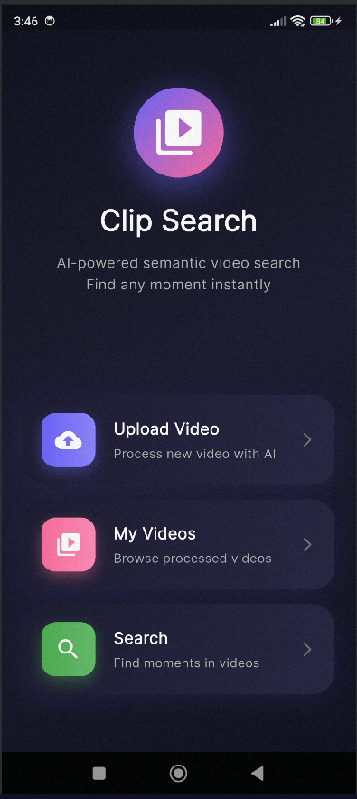
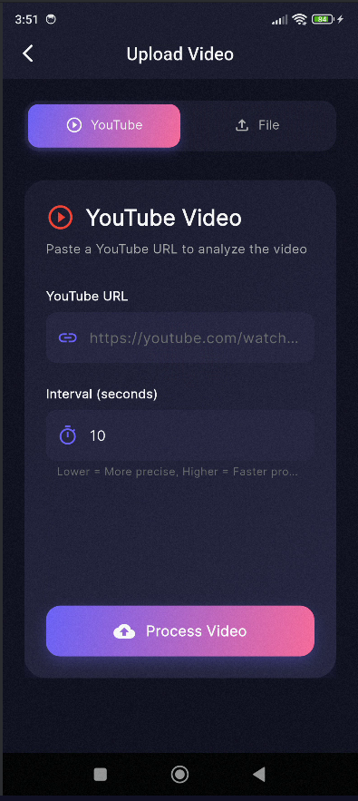
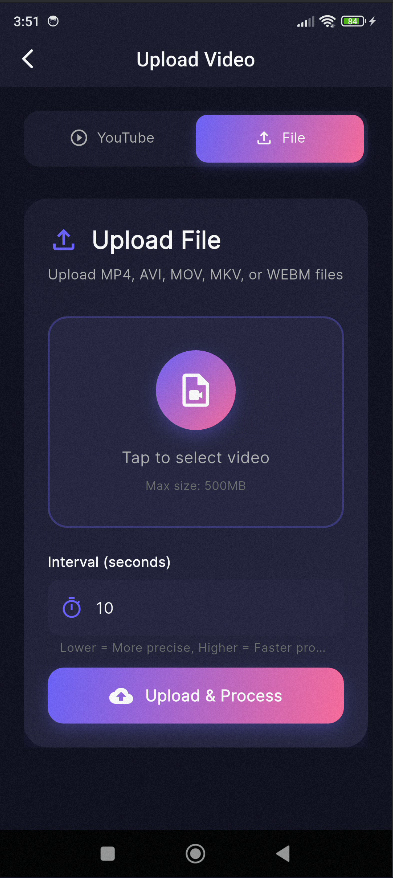
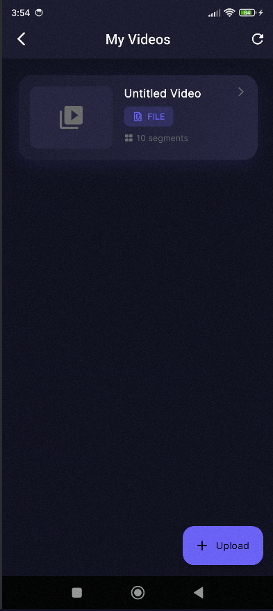
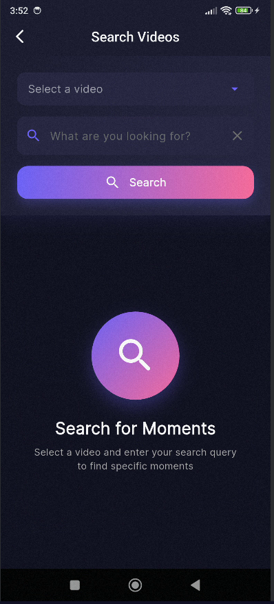

# 🎥 Clip Search Engine

An AI-powered video search application that allows users to search for specific moments within videos using natural language queries. Built with Flask (Python) backend and Flutter frontend.

---

## 🌟 Features

- **YouTube Video Processing**: Paste a YouTube URL and let AI analyze the content
- **File Upload Support**: Upload MP4, AVI, MOV, MKV, WEBM files directly
- **Natural Language Search**: Search videos using conversational queries
- **Smart Video Segmentation**: AI analyzes videos in customizable intervals (default: 10 seconds)
- **Dual Video Playback**: 
  - Uploaded files stream from the backend server with full playback controls
  - YouTube videos open in the YouTube app or browser
- **Semantic Search**: Uses Gemini AI embeddings for intelligent similarity matching

---

## 📸 Screenshots

<div align="center">
  <table>
    <tr>
      <td align="center" width="20%">
        <br/>
        <b>Home Screen</b>
      </td>
      <td align="center" width="20%">
        <br/>
        <b>Upload Video</b>
      </td>
      <td align="center" width="20%">
        <br/>
        <b>Upload Video</b>
      </td>
      <td align="center" width="20%">
        <br/>
        <b>Search Results</b>
      </td>
      <td align="center" width="20%">
        <br/>
        <b>Video Player</b>
      </td>
    </tr>
  </table>
</div>

---

## 🚨 Important Note: YouTube Video Playback

**YouTube videos cannot be played directly in the app due to embedding restrictions:**

- Many YouTube videos have embedding disabled by their owners
- This is a YouTube policy, not a bug in the application
- When you search YouTube videos, clicking results will:
  - ✅ **Open the video in the YouTube app** (recommended)
  - ✅ **Open in your default browser** as a fallback
  - ❌ **Cannot play embedded within the app** due to YouTube restrictions

**Recommendation**: For seamless in-app video playback, **upload video files directly** from your device instead of using YouTube URLs.

---

## 🏗️ Architecture

```
┌─────────────────┐      ┌──────────────────┐      ┌─────────────────┐
│  Flutter App    │─────▶│  Flask Backend   │─────▶│  Gemini AI API  │
│  (BLoC + Dio)   │◀─────│  (Python)        │◀─────│  (Video + Text) │
└─────────────────┘      └──────────────────┘      └─────────────────┘
                                  │
                                  ▼
                         ┌─────────────────┐
                         │   ChromaDB      │
                         │ (Vector Store)  │
                         └─────────────────┘
```

---

## 📋 Prerequisites

### Backend
- Python 3.10.19
- pip
- Gemini API Key ([Get it here](https://makersuite.google.com/app/apikey))

### Frontend
- Flutter SDK 3.27.1
- Dart SDK 3.6.0 
- Android Studio / VScode 

---

## 🚀 Quick Start

### 1. Backend Setup

```bash
# Navigate to backend
cd video-rag-backend

# Create virtual environment
python -m venv venv

# Activate virtual environment
# Windows:
venv\Scripts\activate
# macOS/Linux:
source venv/bin/activate

# Install dependencies
pip install -r requirements.txt

# Create .env file
echo "GEMINI_API_KEY=your_api_key_here" > .env

# Run server
python app.py
```

**Note the IP address shown in console** (e.g., `http://192.168.1.100:5000`)

---

### 2. Frontend Setup

```bash
# Navigate to frontend
cd frontend

# Install dependencies
flutter pub get

# Update API URL in lib/core/constants/api_constants.dart
# Change baseUrl to your backend IP address

# Run the app
flutter run
```

---

## 📁 Project Structure

```
video-context-search/
├── video-rag-backend/          # Python Flask backend
│   ├── app.py                  # Main application
│   ├── services/               # Video processing, embeddings
│   ├── uploads/                # Uploaded videos
│   ├── chroma_db/              # Vector database
│   └── requirements.txt
│
└── frontend/                   # Flutter application
    ├── lib/
    │   ├── core/               # Constants, network
    │   ├── data/               # Models, repositories
    │   └── presentation/       # UI, BLoC, widgets
    ├── screenshots/            # App screenshots (1.png - 4.png)
    └── pubspec.yaml
```

---

## 🎯 How to Use

### Upload a Video

**Option 1: YouTube URL**
1. Click "Upload from YouTube"
2. Paste YouTube URL
3. Set interval (default: 10s)
4. Click "Process Video"

**Option 2: File Upload**
1. Click "Upload from Device"
2. Select video file (MP4, AVI, MOV, MKV, WEBM)
3. Set interval
4. Click "Upload & Process"

### Search Videos

1. Go to "Search" tab
2. Select a processed video
3. Enter your query (e.g., "budget discussion")
4. Click on results to play at that timestamp

---

## 🔧 Key API Endpoints

| Endpoint | Method | Description |
|----------|--------|-------------|
| `/health` | GET | Check server status |
| `/upload/youtube` | POST | Process YouTube video |
| `/upload/file` | POST | Upload & process video file |
| `/search` | POST | Search within video |
| `/videos` | GET | List all processed videos |
| `/stream/{filename}` | GET | Stream video file |

---

## 🛠️ Technologies

### Backend
- Flask (Web framework)
- Google Gemini 1.5 Flash (AI processing)
- ChromaDB (Vector database)
- yt-dlp (YouTube downloader)

### Frontend
- Flutter (UI framework)
- BLoC (State management)
- Dio (HTTP client)
- Video Player / Chewie (Video playback)
- URL Launcher (External links)

---

## ⚙️ Configuration

### Backend Settings (`app.py`)
- `UPLOAD_FOLDER`: Video storage directory
- `MAX_FILE_SIZE`: 500MB default

### Processing Settings
- **Default interval**: 10 seconds
- Lower interval = Better precision, slower processing
- Higher interval = Faster processing, less precision

### Search Settings
- **Default results**: Top 3 matches
- Adjustable per search query

---

### Frontend Issues

**"Connection refused"**
- Ensure backend is running
- Update IP address in `api_constants.dart`
- Check firewall allows port 5000

**YouTube videos won't play**
- This is expected behavior (see note above)
- Videos open in YouTube app instead
- Upload files directly for in-app playback

**Upload fails**
- Check file size < 500MB
- Verify file format (MP4, AVI, MOV, MKV, WEBM)
- Check network connection

---

## 📊 Performance Tips

1. **Test with short videos** (1-3 minutes)
2. **Use 10-second intervals** for balanced performance
3. **Keep ChromaDB on SSD** for faster searches
4. **Process during off-peak hours** for better API response

---

## 🗺️ Future Enhancements

- [ ] User authentication
- [ ] Cloud storage (AWS S3, Google Cloud)
- [ ] Real-time processing updates
- [ ] Export search results
- [ ] Mobile camera upload

---

## 🤝 Contributing

1. Fork the repository
2. Create feature branch (`git checkout -b feature/AmazingFeature`)
3. Commit changes (`git commit -m 'Add AmazingFeature'`)
4. Push to branch (`git push origin feature/AmazingFeature`)
5. Open Pull Request

---

## 📄 License

This project is licensed under the MIT License.

---

## 🙏 Acknowledgments

- [Google Gemini AI](https://ai.google.dev/) - Multimodal AI processing
- [ChromaDB](https://www.trychroma.com/) - Vector database
- [Flutter](https://flutter.dev/) - Cross-platform framework
- [Flask](https://flask.palletsprojects.com/) - Python web framework

---

## 📞 Support

- 🐛 **Issues**: [GitHub Issues](https://github.com/akashverma55/ClipSearch/issues)
- 📧 **Email**: akvakv150@gmail.com

---

**Built with ❤️ using AI and Flutter**